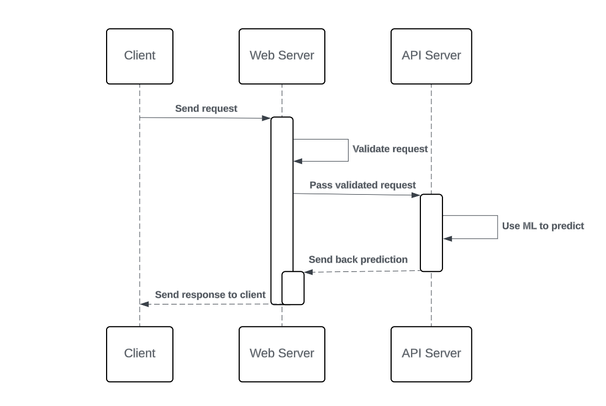

# Introduction
This outlines the technical architecture of a personalized assessment system employing Artificial Intelligence (AI) for a research methodology course, aimed at offering users preliminary disease predictions based on reported symptoms and suggesting a specialist doctor based on the prediction.

# Problem Faced During Implementation
Initially, a single server architecture was attempted.  Nginx was configured to pass dynamic content to Apache2, which would then communicate with the Python Flask server running locally on port 8081. However, this approach proved problematic.  Running machine learning predictions on the same server as the web application resulted in frequent crashes due to insufficient resource availability.

# Solution Chosen
To address this limitation, a two-server architecture was implemented.  This approach separates the web server from the API server, allowing for independent resource allocation.  The web server manages user interaction and front-end functionalities, while the API server processes API requests, conducts disease predictions, and provides JSON responses. This separation ensures scalability and stability as the complexity of the machine learning model grows.

# System Architecture
The system operates on two Ubuntu 22.04 LTS servers with the following specifications:

# Web Server (Running on 1 core Intel CPU, 1 GB RAM, 25 GB SSD):
+ Nginx server delivers static content with restricted access through a UFW firewall.
+ Apache2 server executes the Laravel framework (v11.x) for dynamic content.
+ PHP 8.2+ ensures application functionality.

# API Server (Running on 4 core Intel CPU, 8 GB RAM, 240 GB NVMe SSD):
•	Nginx server manages access control.
•	Python 3.10 runs the Flask server for API requests.
•	Machine learning libraries (joblib, pandas, scikit-learn) facilitate disease prediction.

# Disease Prediction Process
The system utilizes a Kaggle dataset (https://www.kaggle.com/datasets/ebrahimelgazar/doctor-specialist-recommendation-system) to train a predictive model using the random forest algorithm. The trained model files are integrated into the API server for disease prediction based on user-submitted symptoms.

# Laravel Features
+ Country Detection: Identifies user's country and language via IP addresses and stores the information in session.
+ Multilingual Support: Offers localized translations based on user's country and language preference.

# Front-End Technologies
The front-end employs:
+ Bootstrap: A frontend framework for UI development.
+ jQuery: Facilitates communication between the web page and API server for predictions, as well as manipulation of the webpage elements to display prediction results.

# Data Flow

  <i>Figure 1: User-Initiated Disease Prediction Process via Web Interface and AI Models.</i>

 
As shown in the Figure 1, This is the operational process of the system:
+ User submits symptoms through the web interface. 
+ Web server validates the request.
+ Validated data is sent to the API server.
+ API server employs AI models to predict the disease.
+ Prediction results are enriched with additional information and sent back to the web server.
+ Web server forwards the response to the user's browser.
+ jQuery updates the web page with predicted disease details.

# Conclusion
This report effectively outlines a two-server architecture for a personalized assessment system. By separating the web server and API server, the system ensures scalability and stability for processing complex machine learning models.  Leveraging various frameworks and libraries, the system delivers a user-friendly experience with AI-powered predictions.
